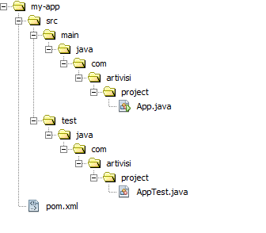

# Konsep dan Arsitektur Aplikasi Desktop #

## Top Level Container ##

## Widget dan Component ##

## Event Handler ##

## Arsitektur Keseluruhan ##

## Setup Project ##

Setiap contoh kode yang ada di modul ini akan dibuat sebagai Maven project. 
Hanya isi file Java nya saja yang berubah, sisanya (struktur folder, konfigurasi, dsb), 
biasanya akan tetap sama. 
Langkah pertama kita buat directory project menggunakan maven, buka aplikasi command prompt/cmd lalu ketikkan perintah berikut :

`
mvn archetype:create -DgroupId=com.artivisi.project -DartifactId=my-app
`

Dengan perintah diatas akan menghasilkan directory-directory dan file-file yang akan membentuk struktur project.

### Struktur Folder ###
Berikut adalah screenshot folder yang telah berhasil dibuat dengan perintah diatas.

### Konfigurasi Project (pom.xml) ###

Berikut adalah isi dari pada pom.xml yang ada pada folder "my-app" :

`
<!-- code ini yang mengarah kerepository maven : -->
<project xmlns="http://maven.apache.org/POM/4.0.0" 
         xmlns:xsi="http://www.w3.org/2001/XMLSchema-instance"
         xsi:schemaLocation="http://maven.apache.org/POM/4.0.0 http://maven.apache.org/xsd/maven-4.0.0.xsd">

<!-- code ini bertujuan untuk melakukan compile kedalam jar  -->
  <groupId>com.artivisi.project</groupId>
  <artifactId>my-app</artifactId>
  <version>1.0-SNAPSHOT</version>
  <packaging>jar</packaging>

  <name>my-app</name>
  <url>http://maven.apache.org</url>

  <properties>
    <project.build.sourceEncoding>UTF-8</project.build.sourceEncoding>
  </properties>
  
<!-- code ini adalah dependensi yang dapat kita tambah sesuai project yang dibuat  -->
  <dependencies>
    <dependency>
      <groupId>junit</groupId>
      <artifactId>junit</artifactId>
      <version>3.8.1</version>
      <scope>test</scope>
    </dependency>
  </dependencies>
  </project>

`

### Kode Program Java ###

Program java sederhana pun akan otomatis terbuat dengan nama "App.java"  pada directory "\my-app\src\main\java\com\artivisi\project" , berikut dapat kita lihat isi dari "App.java" :

`
package com.artivisi.project;

/**
 * Hello world!
 *
 */
public class App 
{
    public static void main( String[] args )
    {
        System.out.println( "Hello World!" );
    }
}

`

### Menjalankan Program ###

Jika telah selesai dibuat struktur foldernya maka kita dapat kembali ke- command prompt/cmd dan mengetikkan perintah ini :

`
mvn clean install
`
Ada pun perintah diatas bertujuan untuk melakukan clean untuk mencegah terjadinya error pada saat compile atau menjalankan project.

Gunakan perintah ini untuk menjadikan App.java sebagai main class sekaligus untuk compile project menjadi ".jar" :

`
mvn exec:java -Dexec.mainClass=com.artivisi.project.App
`
Setalah di compile kita dapat menjalankan aplikasi dengan perintah dibawah ini :

`
mvn clean package exec:java -Dexec.mainClass=com.artivisi.project.App -Dexec.classpathScope=runtime
`
Jika setiap langkah-langkah diatas berhasil maka kita telah selesai.
